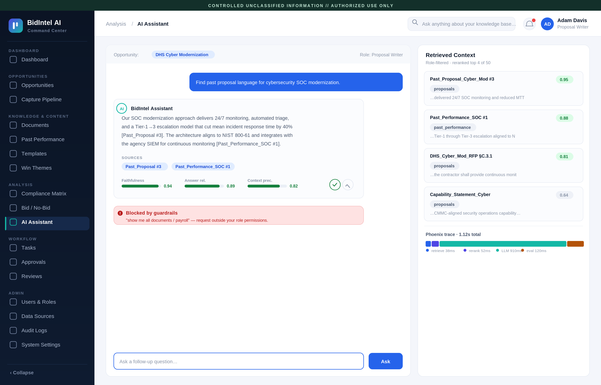
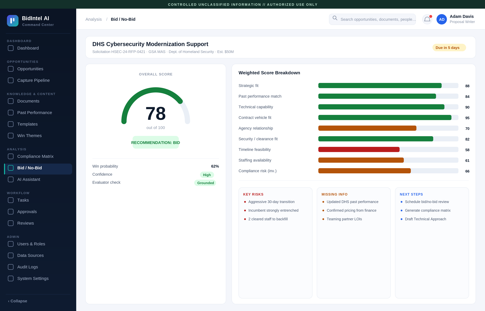
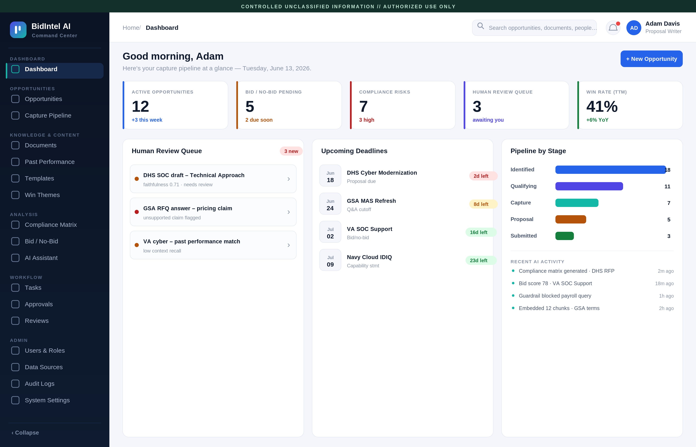
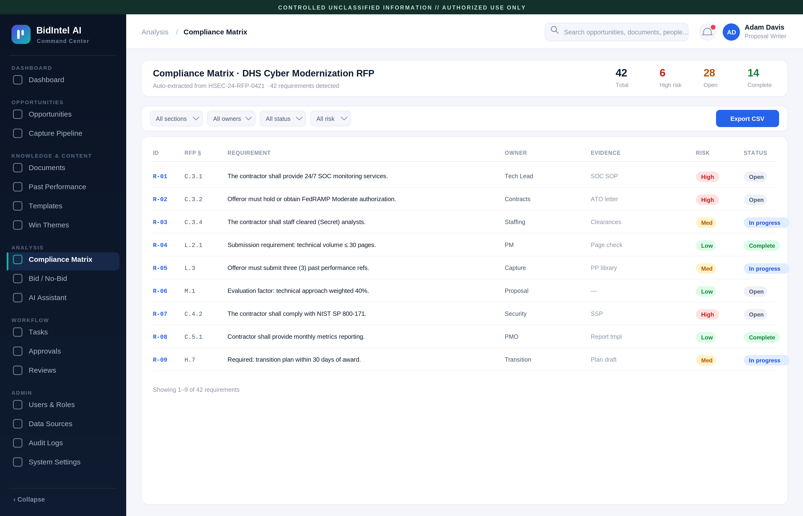
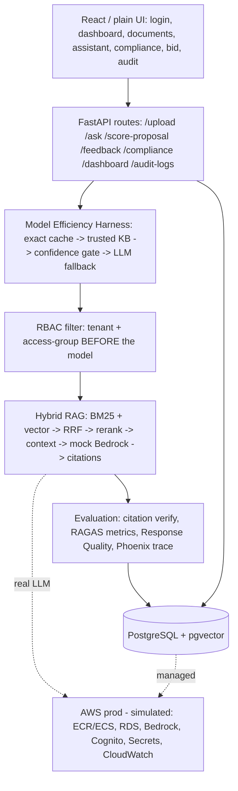

# BidIntel V9 — Enterprise Hybrid RAG Analyst Platform

> **Standalone V9 hardening repo.** This repository is intentionally separate
> from `Souljahsmitty/bidintel-enterprise-rag` so the V9 follow-along work can
> be developed, tested, and reviewed without breaking the earlier public repo.
> V9 keeps the strong V8 architecture, then integrates the audited fixes:
> pre-cache prompt-injection guardrails, pre-ingest document upload safety,
> cache proof, clearer Docker/Postgres recovery steps, and honest
> real-vs-simulated labels.

V9 artifacts live in `docs/v9/`:

- `BidIntel_ZeroToBuild_Masterclass_v9_Chapter_Gate.md`
- `BidIntel_ZeroToBuild_Masterclass_v9_Build_Update.md`
- `BidIntel_ZeroToBuild_Masterclass_v9_Hardening_Package.pdf`
- `BidIntel_ZeroToBuild_Masterclass_v9_delta_proof.mp4`
- `BidIntel_ZeroToBuild_Masterclass_v9_delta_manifest.json`

Truth boundary: the included MP4 is a V9 hardening delta/proof artifact, not
the final full 140-minute V9 masterclass render. The finished V9 course should
look like V8's full masterclass, only corrected chapter by chapter.

FastAPI + React + PostgreSQL/pgvector + BM25 + RRF + Reranker + (mock) AWS Bedrock,
with RBAC, a model-efficiency harness, evaluation scoring, citation verification,
user feedback, local security guardrails, document upload safety, and observability.


> **Read first — this is a local-first portfolio build.** It is **not deployed live**: AWS
> (Bedrock, Cognito, RDS, ECS), plus Phoenix and RAGAS, are **simulated behind clean interfaces**
> (one-line swaps — see the table below). Everything in the retrieval + evaluation pipeline runs
> for real locally. The full-UI path downloads the embedding + reranker models on first run
> (**needs internet, ~a few hundred MB**); for an air-gapped sandbox use the zero-setup
> `backend/scripts/sim_workflow.py`. Proposal scoring + the citation judge are simplified
> placeholders (labeled in code). Screenshots below are design comps until you capture live ones.

## Contents
- [Screenshots](#screenshots) · [Architecture](#architecture) · [Simulated vs. Production](#simulated-vs-production-deliberate-cost-aware-scoping)
- [See the pipeline work](#see-the-pipeline-work-3-ways-easiest-first) · [Requirements & caveats](#requirements--caveats-read-first)
- [Quick start](#quick-start-one-command) · [Enterprise layer](#enterprise-layer) · [Proof commands](#proof-commands-verified)
- [Directory structure](STRUCTURE.md) · [Docs](#docs) · [Security](#security)

## Screenshots
| AI Assistant (cited answers + quality) | Bid / No-Bid scoring |
|---|---|
|  |  |
| Dashboard | Compliance matrix |
|  |  |

> These are the screen designs. The runnable UI ships two ways: a React app (`frontend/src`) and a
> no-build plain HTML/CSS/JS site (`frontend/plain`) — same screens, simpler styling.

## Architecture


## Simulated vs. Production (deliberate, cost-aware scoping)
Everything in the **retrieval + evaluation pipeline runs for real locally** (Postgres, pgvector,
BM25, vector search, RRF, reranker, context builder, RBAC, citations, scoring, audit). The
**paid/managed** pieces are mocked behind clean interfaces so the project stays free to run and
inspect — each is a one-function swap to go live. This is by design, not an unfinished edge.

| Component | Local (this repo) | Production swap | IAM permission needed | Rough cost |
|-----------|-------------------|-----------------|-----------------------|------------|
| Model efficiency | Exact answer cache + trusted-KB confidence gate can skip LLM calls | Bedrock prompt caching + Redis/OpenSearch cache + approval workflow | RDS/Redis/OpenSearch access | reduces repeated LLM calls |
| Guardrails | local prompt-injection, PII, and secret scanner runs before `/ask` cache/retrieval and before `/upload` chunking/storage | Bedrock Guardrails + enterprise DLP + malware scan + quarantine storage | Bedrock Guardrails, S3, DLP/security tooling | varies by service |
| LLM generation | `bedrock_llm_service.py` mock returns a grounded answer only after cache/KG miss or low confidence | `boto3 bedrock-runtime.invoke_model` (Claude) | `bedrock:InvokeModel` | ~$3/1M in, ~$15/1M out tokens |
| Embeddings | local `all-MiniLM-L6-v2` (384-dim, free) | Bedrock Titan Embeddings (1536-dim) | `bedrock:InvokeModel` | ~$0.02 / 1M tokens |
| Eval metrics | `ragas_service.py` deterministic heuristics | real RAGAS / DeepEval (LLM-judge) | `bedrock:InvokeModel` (judge) | LLM-judge calls per eval |
| Tracing | `phoenix_service.py` prints spans | Arize Phoenix / OpenInference exporter | none (self-host) or Arize key | free self-host / paid SaaS |
| Citation judge | word-overlap heuristic | LLM-judge "does evidence support claim?" | `bedrock:InvokeModel` | LLM call per claim |
| Auth | local token in `Login.jsx` | Amazon Cognito user pool (JWT) | Cognito pool + app client | free tier covers small use |
| Database | pgvector Docker container | Amazon RDS / Aurora PostgreSQL + pgvector | `rds-db:connect` | ~$15–60/mo small instance |
| Secrets | `.env` file | AWS Secrets Manager | `secretsmanager:GetSecretValue` | ~$0.40/secret/mo |
| Hosting | `docker compose up` | ECR image → ECS Fargate + ALB | task role + execution role | ~$15–40/mo small task |
| Frontend | `python -m http.server` / Vite dev | S3 + CloudFront | none (bucket policy) | pennies at low traffic |

> The two ECS roles are intentional: a **task execution role** (pull image, write logs, read startup
> secrets) and a **task role** (the app calling Bedrock/RDS) — least privilege, no broad admin role.


## See the pipeline work (3 ways, easiest first)
**A. No Docker, no network, no models — runs anywhere (~2s):**
```bash
cd backend && PYTHONPATH=. python scripts/sim_workflow.py
```
Prints the whole SIMULATED flow: ingest -> RBAC filter -> BM25 + vector -> RRF -> rerank ->
context -> (mock) Bedrock answer -> citations -> citation accuracy -> Response Quality -> verdict.
Expected output is saved in `backend/scripts/sim_workflow_output.txt`. It also proves RBAC: a
proposal writer is blocked from HR/payroll evidence; the HR role is allowed.

**B. Full local stack (Docker + first-run model download, needs internet):**
```bash
bash scripts/start_local.sh      # containers -> migrations -> seed -> URLs
bash scripts/demo.sh             # health -> seed -> ask -> cited answer/cache metadata -> RBAC proof
```

**C. Click through the UI:** open `http://localhost:5173` (React) or serve `frontend/plain` and
open `login.html` -> Documents (ingest a PDF) -> AI Assistant (ask) -> see answer + citations + quality.

> Note: it is NOT deployed live (AWS is simulated to stay free). Path A shows the entire workflow
> end-to-end with zero setup; the mock/sim pieces are listed in the table above with their real swap.

## Requirements & caveats (read first)
**To run the full UI locally:** Docker Desktop + internet on first run (downloads
`all-MiniLM-L6-v2` embeddings + a cross-encoder reranker, ~a few hundred MB). 8GB RAM recommended.

**No internet / locked-down sandbox?** Run the whole pipeline end-to-end in a terminal with zero
setup: `cd backend && PYTHONPATH=. python scripts/sim_workflow.py`.

**What is simulated (and why):** to keep this free to run, the paid/managed pieces are mocked —
LLM (Bedrock), embeddings model swap (Titan), eval metrics (RAGAS), tracing (Phoenix), auth
(Cognito), DB host (RDS), hosting (ECS). Each is a one-function swap; see the table above. The
retrieval + evaluation logic itself is real.

**Known placeholders (labeled in code):** `proposal_scoring_service.py` returns illustrative
factor values; the citation judge is a word-overlap heuristic (production = LLM judge).

**Not deployed live:** there is no public URL. AWS steps are documented + simulated, not run.

## Quick start (one command)
```bash
bash scripts/start_local.sh
# Frontend http://localhost:5173 · Swagger http://localhost:8000/docs
```

## What it does
Upload federal solicitation/proposal docs → hybrid retrieval (RBAC-filtered) → rerank →
model-efficiency confidence gate → cache/trusted-KB answer or LLM fallback → grounded, **cited** answer → **evaluation** (citation verify, RAGAS-style
metrics, Response Quality score) → audit + cost/latency logs.

## Enterprise layer
- Security guardrails (input before cache/retrieval, output before cache store, document scan before chunk/embed/store) — `app/security/guardrails_service.py`, `app/api/ask_routes.py`, `app/api/upload_routes.py`
- Model-efficiency harness (exact cache → trusted KB → confidence gate → LLM fallback) — `app/api/ask_routes.py`, `query_cache_service.py`, `confidence_gate_service.py`
- RBAC enforcement (tenant + access-group filter before the model) — `app/security/rbac.py`
- Document versioning (hash → version → mark old chunks inactive) — `document_versioning_service.py`
- Evaluation tables — `database/migrations/003_enterprise_tables.sql`
- Citation verification — `services/evaluation/citation_verifier.py`
- Response Quality scoring — `services/evaluation/response_score_service.py`
- Phoenix tracing (sim) + RAGAS/DeepEval tests (`tests/evals`) + request logs (cost/latency)

## Proof commands (verified)
```bash
cd backend
PYTHONPATH=. python scripts/test_access_control.py   # RBAC: proposal_writer blocked from HR -> True
PYTHONPATH=. python scripts/test_guardrails_v9.py    # prompt injection blocks + upload safety decisions
PYTHONPATH=. python -m pytest tests/evals -q          # RAG quality regression -> 2 passed
# with the stack running (bash scripts/start_local.sh):
PYTHONPATH=. python scripts/seed_mock_corpus.py       # seeds 5 mock federal docs
curl -s localhost:8000/health                          # {"status":"ok","db":"connected"}
```
Logic-level proof (RBAC, RRF fusion, context builder, citations, citation verification, RAGAS
metrics, Response Quality, evaluator) runs without Docker or model downloads and passes.

## Model efficiency harness
`POST /ask` now follows a safest-then-cheapest path:

```text
input guardrail
  -> exact tenant/role/question cache
  -> RBAC-filtered trusted KB retrieval
  -> confidence gate
  -> direct trusted-KB cited answer when confidence is high
  -> Bedrock/Claude fallback only when confidence is low
  -> evaluation + output guardrail + cache store
```

Local Docker runs use the same orchestration with a mock Bedrock model. Production keeps the
same control flow but can add Bedrock prompt caching, Redis/OpenSearch semantic cache, and an
approval workflow for answers stored back into `query_answer_cache`.

Runtime toggles:

```bash
MODEL_EFFICIENCY_ENABLED=true
TRUSTED_KB_DIRECT_ENABLED=true
TRUSTED_KB_CONFIDENCE_THRESHOLD=0.68
```

## Docs
- Architecture: `docs/architecture/bidintel-enterprise-architecture.mmd`
- AWS (simulated): `docs/aws_*_simulation.md`
- Backup/restore: `docs/BACKUP_RESTORE_RUNBOOK.md`
- Demo: `docs/HIRING_MANAGER_DEMO_SCRIPT.md`

## Security
Never commit `.env`, AWS keys, Bedrock creds, DB passwords, or private docs. Use `.env.example`.
